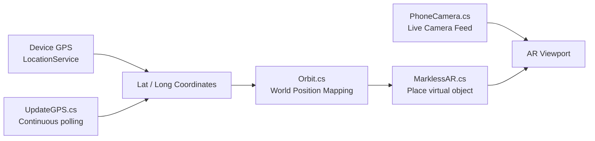

# GPS AR

 

*Location-aware AR app that places virtual content in the real world using GPS coordinates — no markers needed.*

---

## Overview

A **markless augmented reality** app that combines GPS location data with live camera feed to anchor 3D virtual objects at real-world coordinates. As the user moves, the AR content repositions relative to their GPS position — demonstrating the foundation of how apps like Google Maps Live View work.

---

## How It Works

---

## Scripts

| Script | Role |
|---|---|
| `GPS.cs` | Initialises Unity LocationService and reads coordinates |
| `UpdateGPS.cs` | Polls GPS data continuously and pushes updates |
| `Orbit.cs` | Maps GPS delta to 3D world-space positions |
| `PhoneCamera.cs` | Accesses the device camera as a background texture |
| `MarklessAR.cs` | Places and anchors 3D content without a physical marker |

---

## How to Open

1. Install **Unity 2019.2.0f1** (via Unity Hub)
2. Clone this repo and open the `GPS` folder as a Unity project
3. Open `Assets/Scenes/GPS.unity`
4. Build to Android/iOS — GPS permissions are required at runtime

---

Built by [Akhila Susarla](https://github.com/Akhila-Susarla)

